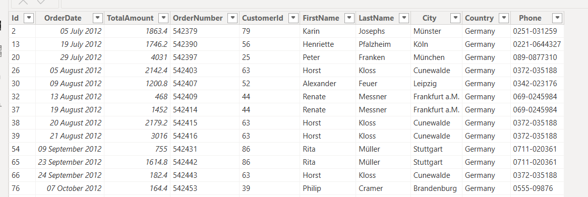
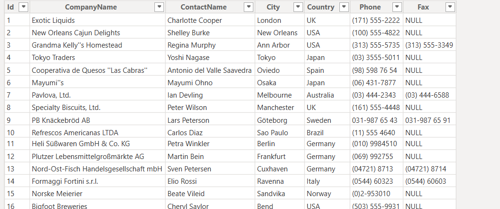
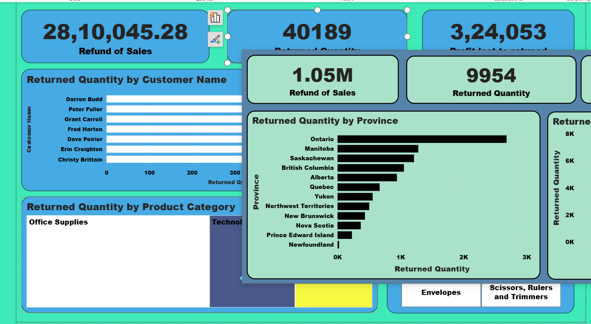

# 📊 Returns Analysis Dashboard (Power BI)

## Problem
Business wanted to understand the financial impact of product returns on revenue, profit, and customer segments.

## Dataset
- Mock dataset (~10,000+ orders, 2009–2012)  
- Fields: Order Date, Customer, Product, Sales, Returns, Refunds, Profit  
⚠️ Note: Mock data used to protect client confidentiality

## Approach
- Built KPIs: Refund of Sales, Returned Quantity, Profit Lost to Returns  
- Created breakdowns by Region, Customer Segment, Product Category  
- Used DAX measures for “Revenue after Returns” and “Profit after Returns”  
- Added slicers for Shipping Mode, Province, Product Sub-Category

## Results
✅ Identified $2.8M in refunded sales and $324K lost profit  
✅ Highlighted regions and customer segments with highest returns  
✅ Gave management visibility into return trends by category & mode

## Preview
  
  

## 📄 Full Report

